# Model Chronological Experimentation (In progress)

This file will be used to document the evolution of the model. 

There is so much to mess with that I likely would forget what has been promising and what hasn't.

The goal is to find the best performing models for predicting the probability of winning in one of the following markets:
* Moneyline - team A winning vs team B
* Spread - a number of points is given for how much team A must beat team B by
* Total - a number for the sum of points scored in a game is given - will it be higher or lower

Sports data is tricky - performance data naturally exists as a lagged series. For example: Points scored 1,2,3,4...,n games ago.
Because of this, any model will consist of latent variables that try to capture meaning from the series. This is the hardest part.

# Creating Latent Variables

## Pace

Pace is the single most important variable, and it is used differently from others. It is defined as the average number of possessions of both teams adjusted for overtime.
Obviously pace is a key part of the total market, but it is also nearly as important in finding edge in the others. 
Even if you know the true relative skill of the two teams, pace will alter the probability of the better team winning: a higher pace game will have less variable results than a lower pace game. At least to start with, our models will use pace as the time parameter, although eventually I will probably compare models that use real time (pace is a simplistic measure in that not all possessions are equal - those from a team with better offensive rebounding would have more shots per possession and thus more points per possession). Additionally, forecasting pace will provide useful lessons for all latent variables.

I have set aside 1996-97 thru 2002-2003 as the training set exclusively for latent variables. Maybe this is unnecessary, I am not sure.

I will explore models that focus on team metrics and player metrics. The granularity of player metrics makes everything complicated but usually is worth it. There is no way to backtest forecasting who will play in the game based on injury news - we have none and even if we did (surely it's out there), it wouldn't be the same level of news we have now. If we assume complete knowledge of who will play, our model will be overconfident. To try to add some uncertainty, we could do things like assume the next lineup will be the same as the previous lineup. This would be using worse information than what we have access to present-day and would serve as a lower bound for a player model.

### Team-based Approaches

#### Naive Methods

The following methods are naive in that they do not involve any fitting or simulations. 

A traditional approach and one I have used in the past with little thought is simply averaging all the metrics by the team in the current season. For the first 5 games, where there is little data, I use a weighted average of the last season's average ((5-n)/5 weighting where n is games played). **Throughout this latent-variable step, we are excluding predictions from the first season since you really need a prior season to 'warm-up' some methods or to encorporate via weighted averaging like this.** To actually forecast the pace for a game, we average each team's latent pace average. For this model, the 'season-avg' label is used.

Another batch of models uses moving averages with a certain amount of games specified. A 5-game moving average pace model would average the last 5 games of pace for a team. Like the above model, we also average each team's latent pace to form a prediction for the pace in a game.

The next one is inspired by ARMA methodology. Like the other methods, we give each team a pace rating. Instead of averaging each team's rating for the final prediction, we will base each team's rating off of half of the pace from games and our prediction will be the sum of each team's pace. To start, every pace rating is set to 42.5. Each game, a prediction is formed, and we get an error term equal to the actual pace in the game minus the prediction. We then adjust each team's pace rating by the error term multiplied by a weight. This variation is labeled "arma_0.1" when the weight is 0.1. This isn't an ARMA model at all, but I wouldn't have thought to do this if not for ARMA methodology...

Finally, I want to try some Bayesian updating. As in the previous method, each team will have a pace rating which is based on 1/2 of the pace in their games. The prediction will be the sum of both team's ratings. In order for a closed form solution for the posterior, we must provide values for each variance. I think it would be best to use a constant variance when updating after every game. Then, the posterior for the mean of the pace rating will be given as a weighted average of the prior rating and 1/2 of the pace in the current game. The weights are based on the relative values of the prior variance and the observed variance, so we can just choose different weights and see how it works. 

#### Naive Results

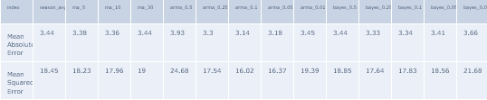 

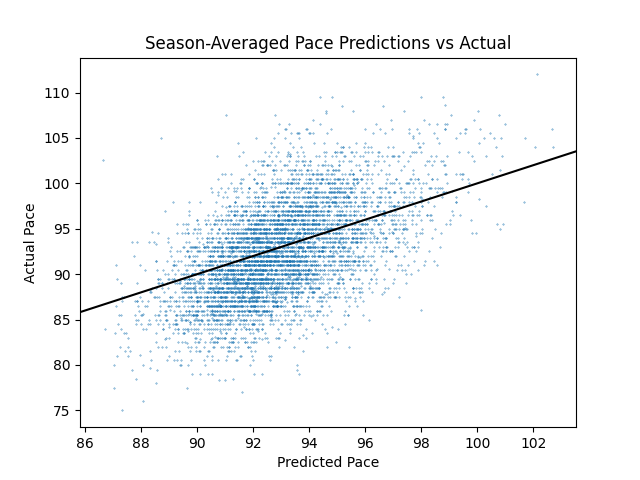
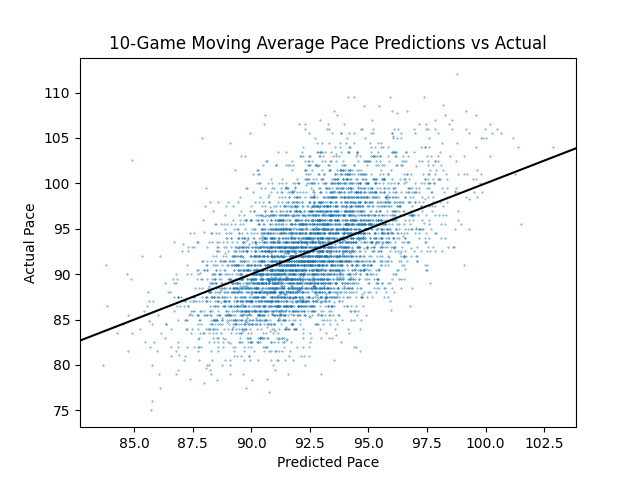
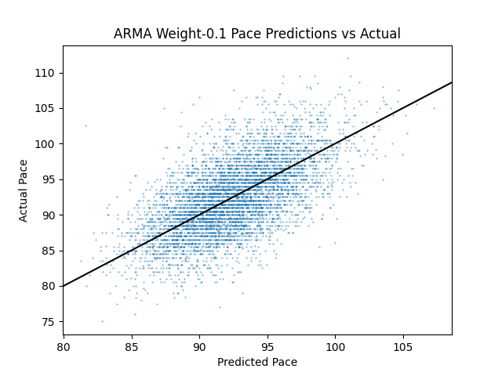
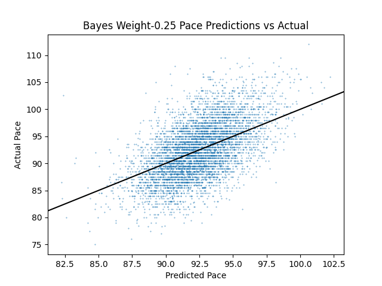

Season_avg performs the worst among the practical alternatives over the inspected time range (seasons 1996-97 thru 2002-2003 - the latent variable training set) which was unexpected. The naive-ARMA method seems to be the best of the naive methods. First, it has the lowest error at the 0.1 weight and the 2nd lowest at the 0.05 weight. Additionally, the other methods seem to not be adaptive enough. We can see from the plots that for games that we estimate to have a lower pace than average, we actually end up overestimating and vice versa for games we predict a higher pace than average. The ARMA updating does not appear to have this issue, which is promising. 

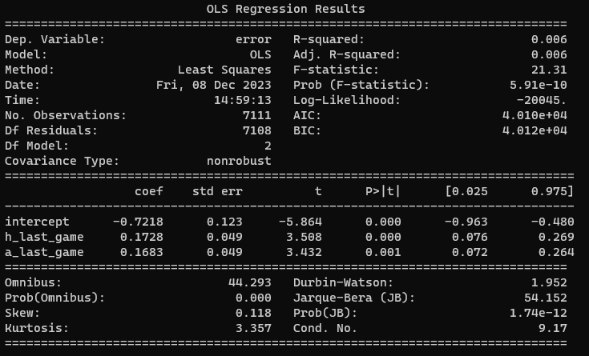

Above is a summary of a regression model to predict the error of the pace from the ARMA_0.1 method. The idea is to see whether or not factors like rest, back-to-backs, and roadtrips affect the pace a team plays with after our prediction is taken into account. I coded this in a few different ways with this way being the only promising outcome: number of days since the last game (capped at 7). I would argue it isn't just overfitting since the coefficients for both the home and the away side are similar indicating a very similar effect. Something to consider...

#### Advanced Methods and Results

We will experiment with a Bayesian hierarchical model. The structure is very simple for a team-based hierarchical model for pace: each team has a 'pace rating' distribution which is initialized as N(47.5, 2). The distribution of the observed pace is N(&mu; pace rating of team A + &mu; pace rating of team B, halfnormal(&sigma;=1)). Predictions are made using the prior distributions of the pace ratings, the posterior distributions are estimated afterwards considering the observed pace, then we set the prior means and standard deviations to the estimated posterior. Computation is done using PYMC and nutpie sampling on Windows. I am choosing to generate 10,000 draws per game day; in turn, running the model through the 2002-03 season takes around 3.5 hours. The first season is excluded from evaluation of predictions.

Below is the base model. Pace rating over time is given with a shaded region for each team indicated 2 standard deviations on either side.

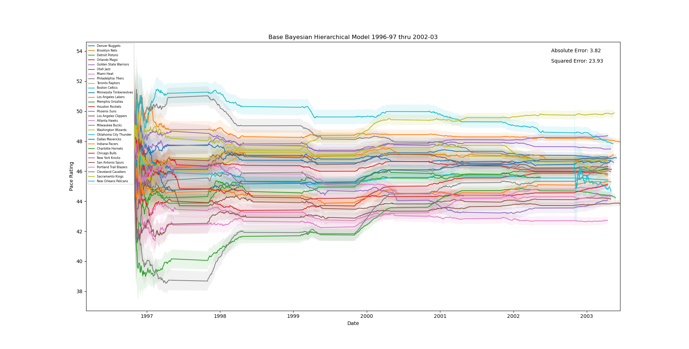

No max sigma, no fattening constant; simply start with sigma = 2 for all and never widen it

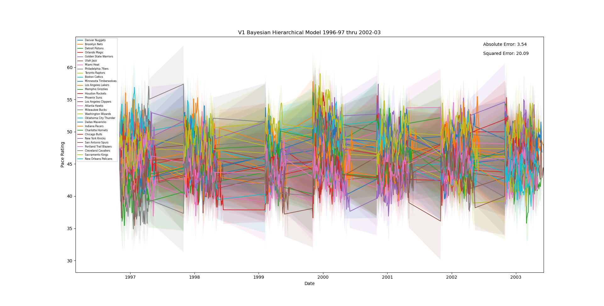

base but with per_game_fatten of 1.1 and max sigma 3

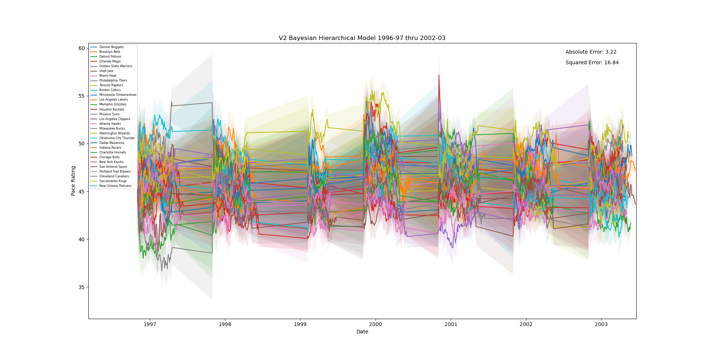

base but with per_game_fatten of 1.025 and max sigma 3 - just realized that fattening was happening to ALL teams after every game and not just to the teams that played

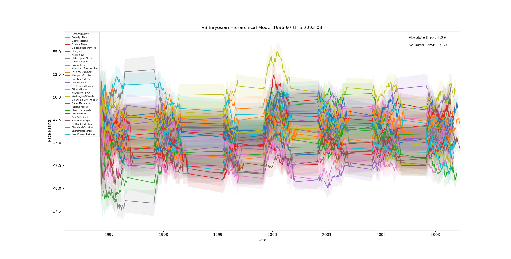

V2 but fixed to only fatten teams who have played

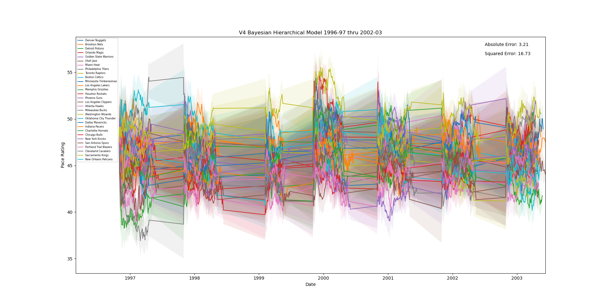

added per_season_fatten = 2 which is the fattening multiplier applied at the end of every season and increased the fattening_per_game to 1.05

### Player-based Approaches

To begin, I chose a team from one season to see how much each player's pace differed from the team pace. I was surprised to find that the pace numbers in the player boxscore are higher overall than the team boxscore. I assume that in tallying the number of possessions a player is on the floor for, when a player is subbed out in the middle of a possession, he technically gets that possession tallied as well as the substitute. We can just adjust for this inflation each game, multiplying by the ratio of the true team pace to the pace as given by the player boxscores. Otherwise, you can see that there is some variation, but not much. How much this practically matters is to be seen.

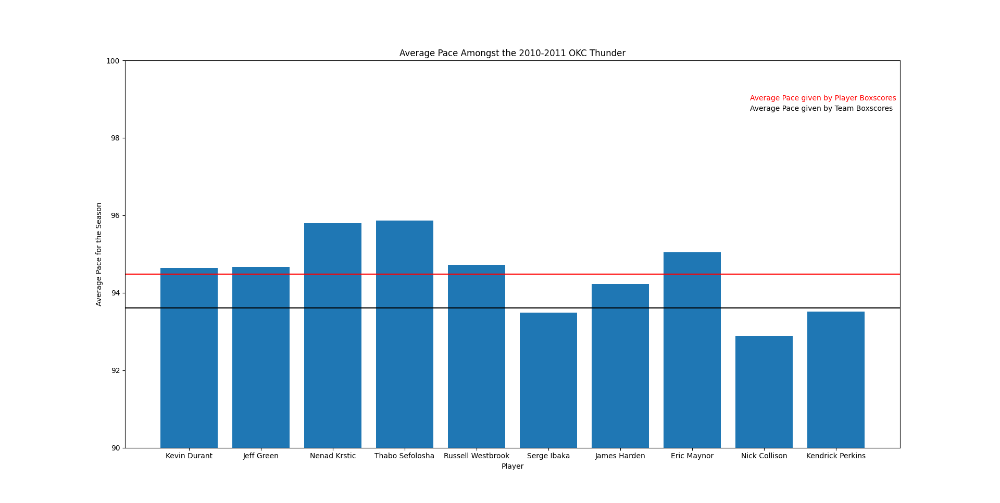

#### Naive Methods 

There are two methods we will try for modeling pace using each player's 'contribution'. Contribution is the pace of the game when they were on the court. Of course, each player is on the court for different amounts of time. A player who plays 5 minutes at the end of the game should not have their pace rating adjusted as much per game as a starter. Additionally, our findings from above show that player paces are higher when combined than team average pace, so we must adjust for that. Both methods we look at will assign each player a pace rating and adjust it after each game. To predict pace using the pace ratings, we will have a full-knowledge approach (denoted 'fk_') that assumes we know exactly how much every player will be playing based on the results from the game and a limited-knowledge approach (denoted 'lk_') that assumes the same play time for each player as the previous game they played (or didn't, in which case, we don't consider them). We won't have full-knowledge when the model is in production, but we will do better than limited-knowledge which has no concept of injury news. 

The first method is the ARMA-related method that was the best for the team approach. One key thing we must do is calculate the 'predicted pace' for the opposing team to adjust a player on any team. Really, it is more like the pace we would expect based on the opposing team's actual play time info. Each player's pace rating is weighted in to the 'predicted pace' based on who actually played and how much. This should give us the other team's contribution to the pace for calculating the error term alongside the player's recorded pace. There is a clear problem of not being able to consider which players are actually on the court on the opposing side for each player.

The other method is the Bayesian updating method. Each player's pace rating is updated according to weights for the prior and posterior.

#### Naive Results

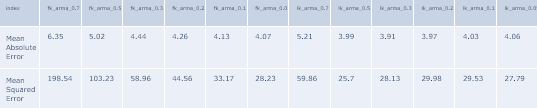 

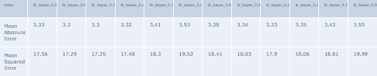 

Simply put, the ARMA method is a mess when we do it for individual players. I suspected as much. It was good for team-based pace because it added more elasticity to the updates, but it's not as easy to convert to players. A lot of the additional steps add noise, and the elasticity of the update method causes swings in player pace ratings based on potentially insignificant observations.

The Bayesian updating provides much better results. However, it is not much better than the Bayesian updating in the team approach and still falls far short of the naive ARMA updating on the team approach.

#### Advanced Methods and Results

Like with the team-based approach, we will use a bayesian hierarchical model; however, we will take the opposing team's expected pace as a constant to start to avoid having to use MCMC. The expected pace will be calculated based on the actual playing time for the players in the game. There are several complexities involved with using a PyMC model properly. First, we don't know which players are on the court at the same time because we haven't gotten play-by-play data yet. Ideally each unique lineup pair should have their pace ratings updated, but since there are, even in a very conservative estimate, at least 10 different pairs per game, this would raise the complexity of the MCMC to such a degree that I expect it wouldn't be worth it. Maybe it would be. I will try it. Second, the amount of time played in the game needs to be accounted for in the update. A player who plays 5 minutes in garbage time is different from a starter who played almost all the game, and their observed standard deviations should be updated accordingly. This is definitely doable with PyMC but I could not find a great way yet. And finally, any PyMC model would take even more time than the 3 hours it takes to run the team-based models. Given how many different choices have to be made to encorporate players into a model, I think it would be better to have a quick closed form solution to start that can be easily tweeked and the effect observed.

There are lots of choices that have to be made to encorporate the individual players. Below are the starting chronological steps for each iteration (game) which will be tweaked in future versions:
* cur_lineup[*team*], itself a dictionary, is populated with keys being player IDs and values being the proportion of time spent in the game for their team **in the current game** - the values sum to 1.
* expected_pace for each team is calculated as each players proportion of game time time each players prior pace rating mean.
* p_sec_inv for each player is recorded. This is the total seconds a player could play in a game (48*60 for no OT) divided by their seconds played. This is what is used to adjust the observed sigma in the update step.
* observed pace for each player is recorded and adjusted to reflect the true team pace boxscore. See the discussion at the start of player based methods for more info.
* the pace predictions for the game are made by multiplying the expected game time proportion for each player by their prior pace rating mean. There are two predictions: one based on cur_lineup and one based on last_lineup. This is based on the idea explained at the beginning of player based naive methods.
* last_lineup[*team*] which is structured exactly like cur_lineup[*team*] is now recorded so that the next prediction for *team* will have the last lineup.
* priors are updated as follows (from https://stats.stackexchange.com/questions/237037/bayesian-updating-with-new-data):
  * prior mean = ((prior mean * (obs_sigma * p_sec_inv)^2) + ((obs_mean - opponent expected pace) * prior_sigma^2)) / (prior_sigma^2 + (obs_sigma * p_sec_inv)^2)
    * we are choosing to scale obs_sigma by p_sec_inv^2, that can be done in any number of ways
    * obs_mean is given as the true pace whereas pace ratings and opponent expected pace are half of the true pace in games to reflect the pace rating effect of each team (half of the game's pace). obs_mean - opponent expected pace thus accounts for the opposing pace rating and isolates the observed effect on the pace rating of the player
  * prior variance = (obs_sigma * p_sec_inv)^2 * prior_sigma^2 / ((obs_sigma * p_sec_inv)^2 + prior_sigma^2)
    * we store prior standard deviation so we also take the square root of the above, also that's why we are squaring the sigma
    * we add a per_game_fatten affect and control for a max sigma level at this step as well if relevant

Below are the versions as they evolve, and not actually versioned in any meaningful way...

V1 - no fattening, start sigma 3, max sigma 6, obs sigma 1

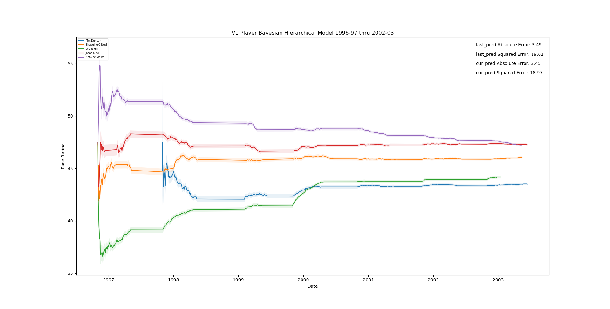

V2 - added per_game_fatten of 1.05

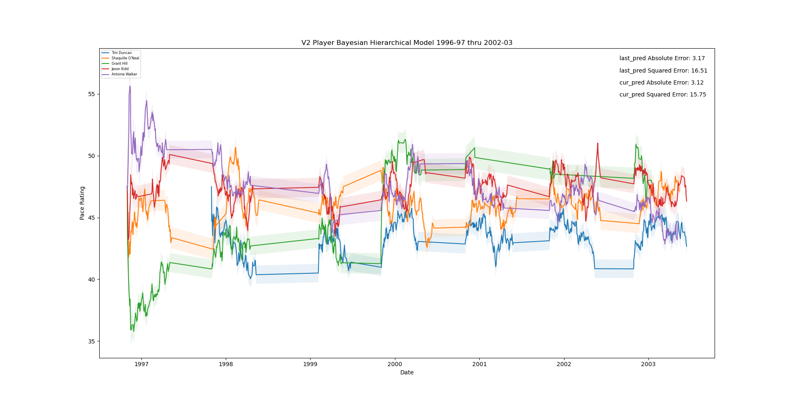

V3 - per_game_fatten of 1.15

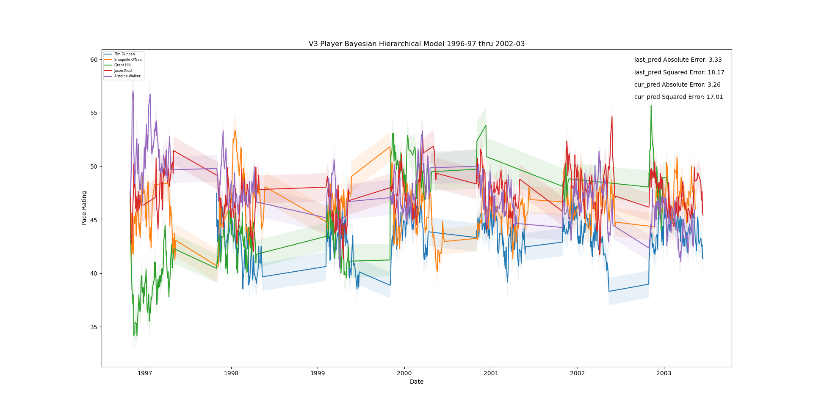

V4 - per_game_fatten of 1.10

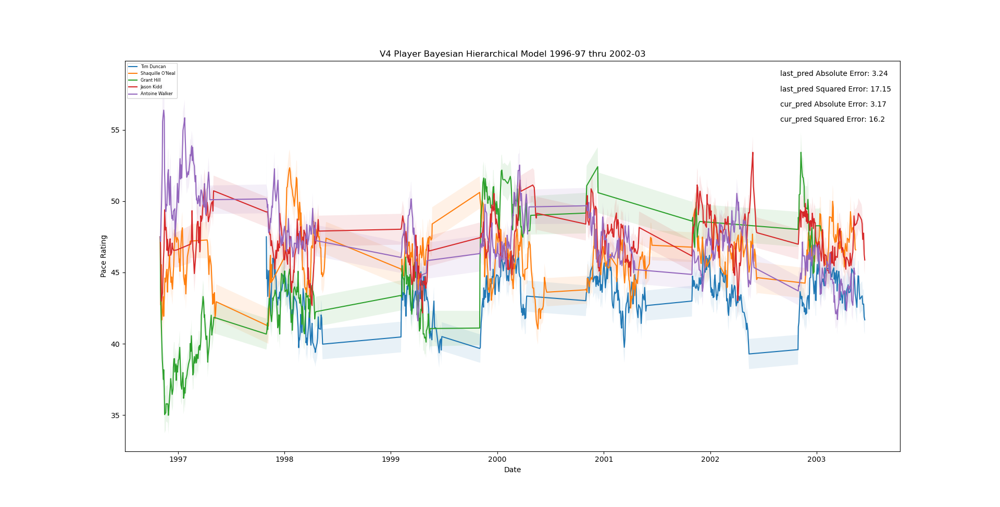

V5 - per_game_fatten of 1.025

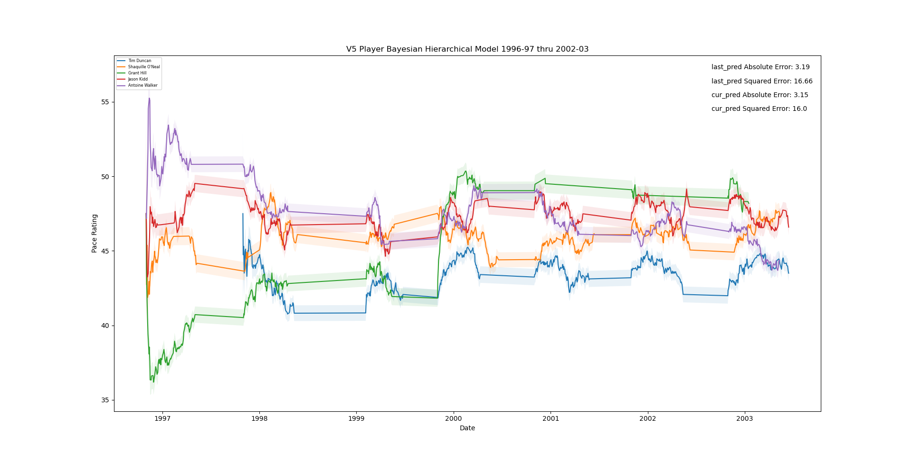

V6 - return to per_game_fatten of 1.05; obs sigma to 3... How is there no real difference from v2??

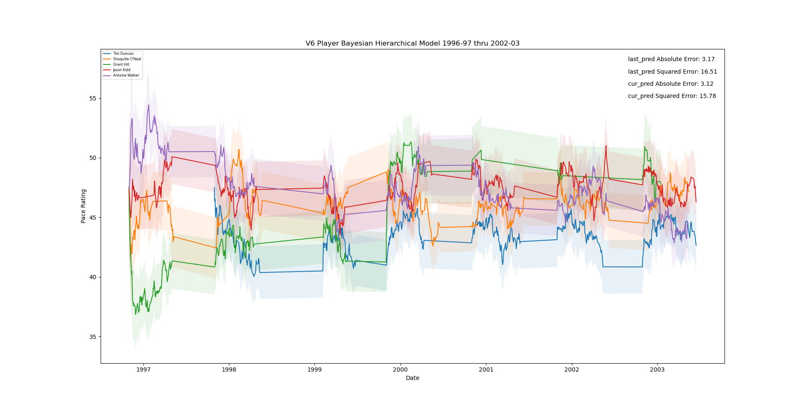

At the present and until further notice, the data will be split up as follows:
* Training Set: 1998-99 through 2013-14 *note: 3 games missing data in the two preceding seasons where we have boxscore data
* Test Set: 2013-14 through 2018-19
* Validation Set: 2019-20 through 2022-23
